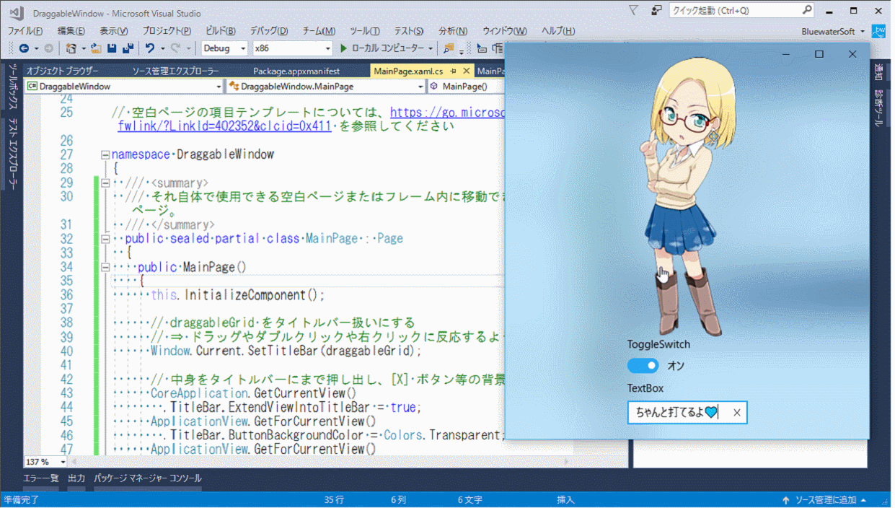

# DraggableWindow
【UWP アプリ】どこでも掴んで動かせるウィンドウ (Visual Studio 2017)

ブログ記事 ⇒ [【#UWP】 どこでも掴んで動かせるウィンドウを作る](http://bluewatersoft.cocolog-nifty.com/blog/2017/07/uwp-07a2.html) (2017/7/30)

- クラウディア画像 [© 2011 Microsoft Corporation All Rights Reserved.](https://msdn.microsoft.com/ja-jp/claudia00_03.aspx)
