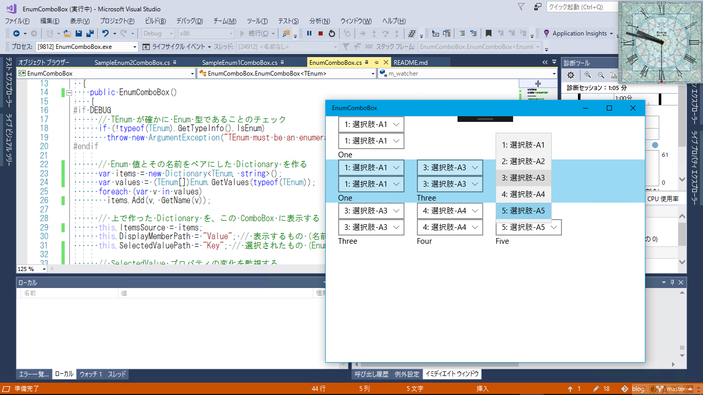

  
# EnumComboBox
【UWP アプリ】Enum 値を入力するための ComboBox (Visual Studio 2017)

  
INotifyPropertyChanged を実装したデータクラスの Enum 型プロパティを ComboBox にバインドします。  
  

## ComboBox コントロールをそのまま使う

画面キャプチャでは、 上下 2 段に配置されている ComboBox の上段のやつです。  

  
まず、 Enum 値をキーとして、 表示文字列をバリューとする Dictionary をスタティックリソースに用意しておきます (SampleEnum1Dictionary)。  
また、 ComboBox と双方向バインディングしたい (ComboBox からバインディングソースに入力したい) プロパティは SampleEnum1Data という名前だとします。  

  
このとき、 ComboBox のプロパティは次のように設定すればいいはずです。  
ItemsSource=&quot;{StaticResource SampleEnum1Dictionary}&quot;  
DisplayMemberPath=&quot;Value&quot;  
SelectedValuePath=&quot;Key&quot;  
SelectedValue=&quot;{Binding SampleEnum1Data, Mode=TwoWay}&quot;  

  
ところが!!  

  
UWP の ComboBox には落とし穴がありまして、 上のようにしたのでは、
バインディングソースが変化しても ComboBox の選択は変わりません (常に SelectedIndex = -1 の状態になる)。  
※ SelectedValue に Enum をバインドしたときだけ生じる不具合のようです。  

  
SelecteIndex の方に int をバインドするのは大丈夫です。
しかたがないので、 Enum 値から選択のインデックス (int 値) へ変換する ValueConverter を作りましょう (EnumToIndexConverter)。  

  
そして、 ComboBox のプロパティを次のように設定すれば、上手く行きます。  
ItemsSource=&quot;{StaticResource SampleEnum1Dictionary}&quot;  
DisplayMemberPath=&quot;Value&quot;  
SelectedIndex=&quot;{Binding SampleEnum1Data, Mode=TwoWay, Converter={StaticResource EnumToIndexConverter}}&quot;  
  

## カスタムコントロールを作る (EnumComboBox)

  
上のやり方だと ComboBox のプロパティ設定がコチャついていて、 面白くないです。  
ItemsSource と SelectedValue に違うものをバインドするのも、 なんだか分かりにくいです。  

  
そういうときは、 ユーザーコントロールやカスタムコントロールを作って、 シンプルに Enum 値のプロパティだけをバインドすれば済むようにしちゃいましょう。  

  
今回は、 ComboBox を継承して EnumComboBox を作りました。  
XAML は、 次のようにスッキリと書けるようになります。  
  
&lt;local:SampleEnum1ComboBox SelectedValue=&quot;{Binding SampleEnum1Data, Mode=TwoWay}&quot; /&gt;  

  
※ WPF ではサックリ作れたんですけどねぇ。 UWP では、 上で述べたバグに対応するため、 DependencyPropertyWatcher なんていう仕掛けを使うはめになりました。

  
  

