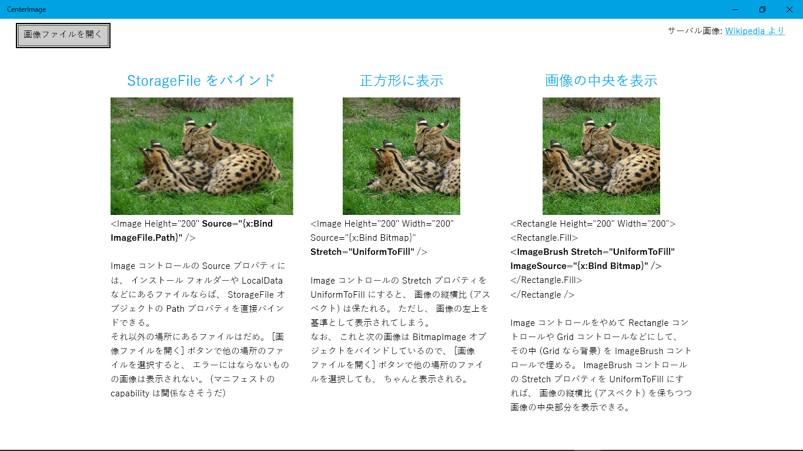

  
# EnumComboBox
【UWP アプリ】Enum 値を入力するための ComboBox (Visual Studio 2017)

Image コントロールの代わりに、 Rectangle とか Grid とかにします。  
で、 その中や背景に ImageBrush を入れてやる。  
すると、 ImageBrush の Stretch プロパティを UniformToFill にしてやれば、
画像の中央部分が表示されます。  

ついでに。  
インストール フォルダー や ms-appdata:///local/ にある画像ファイルは、
その StorageFile オブジェクトの Path を Image コントロールなどに直接バインドできます。  
インストール フォルダー はともかく (だって、 そもそも XAML にパスを指定すればいい)、
ms-appdata:///local/ や ms-appdata:///temporary/ に置いた画像ファイルを表示するには便利♪

