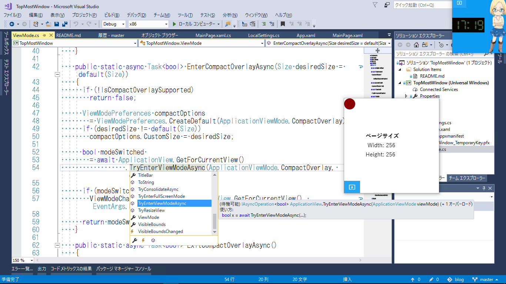

# TopMostWindow

【UWP アプリ】最前面に表示できるウィンドウ (Visual Studio 2017)

CompactOverlay モードを使うサンプルです。  

ブログ記事:  
[【#UWP】 CompactOverlay モード: Picture in Picture というか、「最前面に表示」するウィンドウを作る](http://bluewatersoft.cocolog-nifty.com/blog/2017/08/uwp-compactover.html) (2017/8/16)  

CompactOverlay モードとの切り替え処理は、 [ViewMode クラス](./TopMostWindow/ViewMode.cs) にまとめてあります。

