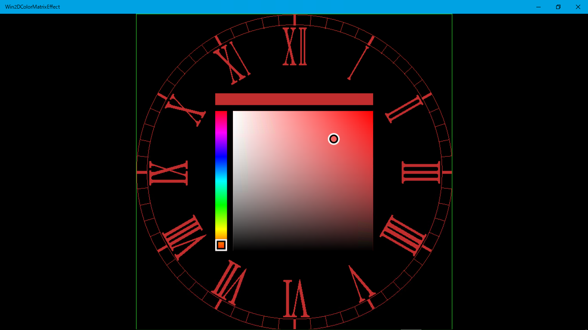

# Win2DColorMatrixEffect

【UWP アプリ】ビットマップ画像の色を変える (Visual Studio 2017)  

[Win2D](http://microsoft.github.io/Win2D/) の [ColorMatrixEffect](http://microsoft.github.io/Win2D/html/T_Microsoft_Graphics_Canvas_Effects_ColorMatrixEffect.htm) を使うサンプルです。  

ブログ記事:  
[【#UWP】 ビットマップの表示色を変える (Win2D.uwp 経由で Direct2D を使う)](http://bluewatersoft.cocolog-nifty.com/blog/2017/08/uwp-win2duwp-di.html) (2017/8/23)  

以下の NuGet パッケージが必要です  
[Win2D.uwp](https://www.nuget.org/packages/Win2D.uwp)  
[Coding4Fun Toolkit](https://www.nuget.org/packages/Coding4Fun.Toolkit.Controls/)  

